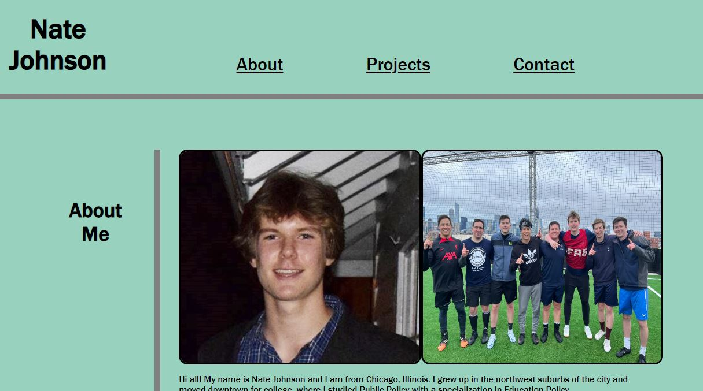

# My Portfolio Project

## Description
This project involved the creation of a webpage that would serve as my own personal portfolio of projects that I have already completed and those that will be completed in the future. The webpage was created without starter code in order to put into practice the HTML and CSS concepts that I have learned so far.
## Installation
N/A

## Usage
To view the portfolio, follow [this link](https://njohnson2897.github.io/my-portfolio/)

The following screenshot demonstrates what the portfolio should look like in a browser:

## Credits
